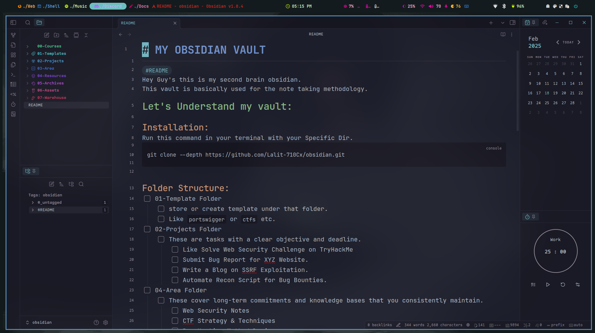

# MY OBSIDIAN VAULT 
--- 

#README
Hey Guy's this is my second brain obsidian.
This vault is basically used for the note taking methodology.
## Let's Understand my vault:

### Installation:

Run this command in your terminal with your Specific Dir.
```console
git clone --depth https://github.com/Lalit-710Cx/obsidian.git
```

### Folder Structure:

- [ ] 01-Template Folder
	- [ ] store or create template under that folder.
	- [ ] Like `portswigger` or `ctfs` etc.
- [ ] 02-Projects Folder
	- [ ] These are tasks with a clear objective and deadline.
		- [ ] Like Solve Web Security Challenge on TryHackMe
		- [ ] Submit Bug Report for XYZ Website.
		- [ ] Write a Blog on SSRF Exploitation.
		- [ ] Automate Recon Script for Bug Bounties.
- [ ] 04-Area Folder
	- [ ] These cover long-term commitments and knowledge bases that you consistently maintain.
		- [ ] Web Security Notes 
		- [ ] CTF Strategy & Techniques
		- [ ] Bug Hunting Methodologies
		- [ ] Pentesting Workflow
- [ ] 03-Resources Folder
	- [ ] These contain useful information for future reference but are not tied to an active project
		- [ ] List of Common XSS Payloads
		- [ ] Nmap Cheat Sheet.
		- [ ] Burp Suite Extensions Guide.
		- [ ] IoT Security Research Papers
- [ ] 04-Archives Folder
	- [ ] These store old notes, completed projects, and past research that may still be useful.
		- [ ] Resolved CTF Writeups.
		- [ ] Past Bug Bounty Reports.
		- [ ] Old Recon Scripts.
		- [ ] Completed OSCP Study Notes.
- [ ] 05-Assets Folder
	- [ ] for store Images or webp.
- [ ] 07-Warehouse Folder
	- [ ] it used for creating new directory 
### Some Remember Things:

- [ ] Do not create any kind of folder inside of .obsidian
- [ ] Every Folder, there is an meaning.
- [ ] You must add tag in every file for future reference.
- [ ] always create `example-file-type.md` don't use `example_like_this`
- [ ] There is no need to delete any file.
### Snippets:

this is extra snippets I added for better theme and UI.
```console
 colored-sidebar-items.css
 cosmos-general-tweaks.css
 cyanvoxels-general-tweaks.css
 daily-note-themes.css
 note-headers-sniffet.css
 notebook-backgrounds.css
```
### Plugins:

Here is the plugin which I added to my `.obsidian`
```console
 automatic-table-of-contents
 calendar
 emoji-shortcodes
 heading-level-indent
 iconic
 obsidian-hotkeys-for-templates
 obsidian-pandoc
 obsidian-relative-line-numbers
 obsidian-style-settings
 obsidian-tagfolder
 obsidian-vimrc-support
 pomodoro-timer
 quick-latex
 settings-search
 table-editor-obsidian
 tag-wrangler
 templater-obsidian
 url-into-selection
 various-complements
```